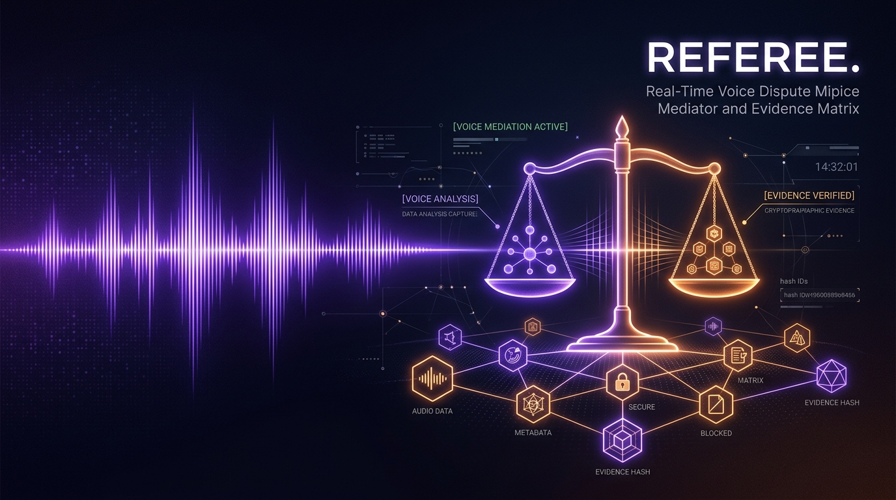

# Referee — Real-Time Dispute Mediator & Verbatim Evidence Matrix

> **An impartial triadic mediator sitting between disputing parties: capturing live speech, pinning verbatim commitments, tracking disagreement in real time, and synthesizing binding settlement terms approved by humans.**

---

## Overview

Disputes between landlords and tenants, clients and contractors, or buyers and sellers often collapse into emotional deadlocks, selective memory, and unresolved friction. 

**Referee** acts as an objective, neutral third party in the room. Operating as a triadic mediator (**Party A**, **Party B**, and **The Referee**), the system continuously listens to dialogue, verifies factual commitments against audio records, monitors the tension/disagreement gap, and translates messy arguments into an evidentiary record culminating in a mutually agreed, tamper-evident settlement agreement.

---

## Core Capabilities

### 1. Dual Speech Engine with Real-Time Transcription
- **Sub-Second Streaming**: Directly streams audio over WebSockets to AssemblyAI v3 streaming infrastructure for immediate transcription.
- **Resilient Fallback**: Gracefully shifts to browser Web Speech API when operating in constrained environments or without API credentials.
- **Audio Processing**: High-fidelity microphone input processing with Web Audio API nodes, noise suppression, and real-time waveform visualization.
- **Recorded Audio Ingestion**: Upload audio files for complete transcript parsing and comprehensive automated resolution notes.

### 2. Triadic Mediation Architecture
- **Three-Way Role Segregation**: Explicitly separates statements from **Party A (Claimant)**, **Party B (Respondent)**, and **The Referee (Neutral Arbiter)**.
- **Real-Time Disagreement Index**: Live metric analyzing divergence and convergence in party testimonies.
- **Direct Room Sharing**: Unique room codes with role-specific entry URLs (`?room=XYZ&role=a|b|ref`) allowing remote participants to join the same mediation room simultaneously.

### 3. Verbatim Evidence Matrix
- **Commitment Extraction**: Automatically surfaces key statements, categorizing them into:
  - `Financial` (agreed numbers, deductions, outstanding invoices)
  - `Timeline` (deadlines, delivery dates, handover periods)
  - `Obligation` (actions each party must perform)
  - `Admission` (concessions or acknowledgments of fact)
- **Quote Grounding**: All pinned claims remain strictly anchored to exact verbatim transcript citations to prevent hallucination or distortion.

### 4. 4-Phase Dispute Lifecycle
1. **Phase 1 — Hearing**: Both sides present their statements; live speaker switching and continuous transcription capture the dialogue.
2. **Phase 2 — Deliberation**: The evidence matrix compiles admissions and claims; either party can contest or verify items.
3. **Phase 3 — Settlement Drafting**: A balanced resolution proposal is generated with clear reciprocal obligations, grounded quote references, and bilateral amendment inputs.
4. **Phase 4 — Execution & Sealing**: Both parties review and formally sign. Once executed, the agreement is locked and permanently sealed.

### 5. Cryptographic Sealing & Document Vault
- **SHA-256 Tamper-Evident Seal**: Computes a cryptographic checksum of the entire hearing transcript, verified evidence, reciprocal terms, and signatures.
- **Instant Legal PDF Generation**: Produces an executive-ready dispute resolution document via `jspdf`, including timestamps, case metadata, verbatim extracts, signatures, and hash verification badges.
- **Cloud Vault & Realtime Sync**: Backed by Supabase database tables and real-time channels for live synchronization and persistent document retrieval.

---

## Technical Architecture

```
                    ┌───────────────────────────────┐
                    │      Disputing Parties        │
                    │   (Party A  /  Party B)       │
                    └───────────────┬───────────────┘
                                    │ Live Speech / Audio
                                    ▼
       ┌────────────────────────────────────────────────────────┐
       │             Referee Audio & Speech Engine             │
       │  • Web Audio API & Waveform Processing                │
       │  • AssemblyAI v3 WebSocket Streaming (<300ms)          │
       │  • Resilient Browser Speech Engine Fallback           │
       └────────────────────────────┬───────────────────────────┘
                                    │
                                    ▼
       ┌────────────────────────────────────────────────────────┐
       │             Mediation & Evidence Engine                │
       │  • Turn-taking & Triadic Role Attribution              │
       │  • Verbatim Commitment Pinning                         │
       │  • Disagreement Convergence Calculation                │
       └────────────────────────────┬───────────────────────────┘
                                    │
                                    ▼
       ┌────────────────────────────────────────────────────────┐
       │             Settlement & Sealing Pipeline              │
       │  • Balanced Reciprocal Obligations Drafting            │
       │  • Bilateral Signature Gateways                        │
       │  • SHA-256 Tamper-Evident Cryptographic Record         │
       │  • Executive PDF Document Synthesis (jspdf)            │
       └────────────────────────────┬───────────────────────────┘
                                    │
                                    ▼
       ┌────────────────────────────────────────────────────────┐
       │             Storage & Realtime Collaboration           │
       │  • Supabase Realtime Channels (Live State Broadcast)   │
       │  • Supabase PostgreSQL (Evidence, Rooms, Vault)        │
       └────────────────────────────────────────────────────────┘
```

---

## Tech Stack

| Layer | Technologies |
|---|---|
| **Framework & UI** | React 18, TypeScript, Vite 6 |
| **Icons & Visuals** | Lucide React, Canvas Confetti |
| **Styling** | Neobrutalist high-contrast design system, Custom CSS Tokens, Dark/Light Mode |
| **Speech & AI** | AssemblyAI v3 WebSocket Streaming, AssemblyAI LeMur, Web Speech API |
| **Backend & Realtime**| Supabase Client, Supabase Realtime Channels, PostgreSQL |
| **Document Engine** | jsPDF, SHA-256 Web Crypto API |

---

## Getting Started

### Prerequisites
- **Node.js** (v18.0 or higher recommended)
- **npm** or **pnpm** / **yarn**
- Modern Web Browser (Chrome, Edge, Firefox, Brave, Safari)

### 1. Clone the Repository
```bash
git clone https://github.com/sandman-sh/Referee.git
cd Referee
```

### 2. Install Dependencies
```bash
npm install
```

### 3. Configure Environment Variables
Copy `.env.example` to `.env`:
```bash
cp .env.example .env
```

Populate the required credentials in `.env`:
```env
# AssemblyAI Streaming API Key
VITE_ASSEMBLYAI_API_KEY=your_assemblyai_api_key_here

# Supabase Realtime & Database Configuration
VITE_SUPABASE_URL=https://your-project.supabase.co
VITE_SUPABASE_ANON_KEY=your-supabase-anon-key-here
```

*(Note: If no API key is specified, the application seamlessly utilizes the browser-native speech recognition engine).*

### 4. Run the Development Server
```bash
npm run dev
```

Navigate to `http://localhost:5173/` in your browser.

### 5. Build for Production
```bash
npm run build
```

To preview the built production bundle:
```bash
npm run preview
```

---

## Directory Structure

```
Referee/
├── docs/
│   └── banner.jpg               # Project visual header
├── src/
│   ├── components/
│   │   ├── AudioWaveform.tsx    # Real-time visual audio frequency waves
│   │   ├── InteractiveMiniTester.tsx # Live audio verification tester
│   │   ├── Navbar.tsx           # Global navigation with theme switcher
│   │   └── SettingsModal.tsx    # API key configuration modal
│   ├── services/
│   │   ├── assemblyai.ts        # AssemblyAI v3 WebSocket and file processing
│   │   └── supabase.ts          # Supabase client, tables, and realtime rooms
│   ├── types/
│   │   └── index.ts             # TypeScript definitions for mediation state
│   ├── utils/
│   │   ├── audio.ts             # Web Audio API cues, SHA-256, extractors
│   │   └── pdf.ts               # jsPDF formal settlement generation
│   ├── views/
│   │   ├── DocumentDashboard.tsx# Vault for sealed dispute records
│   │   ├── Homepage.tsx         # Product overview and live mini-tester
│   │   └── MediationConsole.tsx # Primary 4-phase mediation workspace
│   ├── App.tsx                  # Root routing and theme provider
│   ├── index.css                # Custom design system and themes
│   └── main.tsx                 # React DOM mount point
├── .env.example                 # Environment variable template
├── index.html                   # HTML entry point
├── package.json                 # Project dependencies and scripts
├── tsconfig.json                # TypeScript compiler configuration
└── vite.config.ts               # Vite bundler configuration
```

---

## Preconfigured Conflict Scenarios

Referee includes interactive preloaded scenarios to demonstrate end-to-end mediation:

1. **Security Deposit Return**: Tenancy dispute between landlord and tenant regarding deduction amounts and timeline for deposit refund.
2. **Freelance Design Contract**: Scope dispute between designer and client over asset deliverables and final invoice release.
3. **Marketplace Electronics Transaction**: Dispute between buyer and seller concerning condition of goods and partial refund agreement.
4. **Custom Hearing**: Full custom scenario room allowing manual participant names and dynamic dispute parameters.

---

## Dispute Lifecycle Walkthrough

```
[Phase 1: Hearing]
       │
       ▼  Speech streaming captures live statements from Party A and Party B
[Phase 2: Deliberation]
       │
       ▼  Verbatim commitments pinned into Evidence Matrix (Financial / Timeline / Obligation)
[Phase 3: Settlement]
       │
       ▼  Mutual terms drafted with grounded citations and bilateral amendments
[Phase 4: Sealed Agreement]
       │
       ▼  Both parties digitally confirm -> Cryptographic SHA-256 Seal -> Formal PDF Download
```

---

## Security & Integrity

- **Cryptographic Seal**: Once sealed, any alteration to transcript text, signatures, or obligations invalidates the record's SHA-256 hash.
- **Client-Side Privacy**: Speech streams directly through secure WebSocket connections without persistent intermediate caching of unencrypted audio.
- **Bilateral Approval Guarantee**: No settlement is ever executed automatically; explicit digital signatures from both parties are strictly required.

---

## License

MIT License. See [LICENSE](LICENSE) for details.
